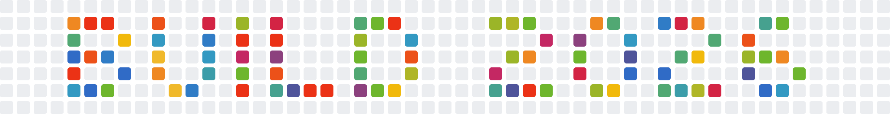

# Commit Crawl

<p align="center">
  <a href="https://github.com/leereilly/gh-commit-crawl/actions/workflows/ci.yml">
    
  </a>
  <a href="https://github.com/leereilly/gh-commit-crawl/releases">
    
  </a>
  <a href="LICENSE">
    
  </a>
  <a href="https://github.com/features/copilot">
    
  </a>
</p>


A tiny terminal roguelike themed on Microsoft Build. Squash bugs (`b`), grab green commits (`+`), and climb five letter-shaped dungeons that spell **B-U-I-L-D**. Survive to the end and you'll get your custom Build-themed contribution graph for your GitHub handle  Throw it on on your README profiles, your LinkedIn cover image, or print it and stick it on your (work) fridge.

You'll get a GIF _with_ `BUILD 2026`



And a GIF _without_ `BUILD 2026`


And an SVG


And yes, there are like and dark mode versions.

## Install

`commit-crawl` is a [GitHub CLI](https://cli.github.com) extension, so
you'll need `gh` first:

- **macOS:** `brew install gh`
- **Windows:** `winget install --id GitHub.cli`
- **Linux:** see the [official install instructions](https://github.com/cli/cli#installation)

Then install the extension:

```sh
gh extension install leereilly/gh-commit-crawl
```

Upgrade later with `gh extension upgrade commit-crawl`.

### Other ways to install

```sh
# Direct Go install (no gh required; ships under the cmd binary name)
go install github.com/leereilly/commit-crawl/cmd/commit-crawl@latest
```

## Quick start

```sh
gh commit-crawl                         # play the game
gh commit-crawl -seed 42               # deterministic run
gh commit-crawl -no-color
```

## Keybindings

Play with arrows, vi-keys (hjkl), WASD, and the numpad all work simultaneously.


| Action          | Keys                                          |
| --------------- | --------------------------------------------- |
| Move N/S/W/E    | `↑` `↓` `←` `→` · `k` `j` `h` `l` · `w` `s` `a` `d` · numpad `8` `2` `4` `6` |
| Move diagonals  | `y` `u` `b` `n` · numpad `7` `9` `1` `3`      |
| Wait one turn   | `.` · `space` · numpad `5`                    |
| Ascend stairs   | `>` (when standing on `>`)                    |
| Help            | `?`                                           |
| Quit            | `q` · `Esc` · `Ctrl-C`                        |
| Restart         | `r` (on death / win screen) · `Enter`         |

## Build from source

Requires [Go 1.26+](https://go.dev/dl/).

```sh
git clone https://github.com/leereilly/gh-commit-crawl
cd gh-commit-crawl
go build -o gh-commit-crawl ./cmd/commit-crawl
./gh-commit-crawl
```

Tests, vet, and format:

```sh
go test ./...
go vet ./...
gofmt -l .
```

CI ([`.github/workflows/ci.yml`](.github/workflows/ci.yml)) runs the same checks on macOS, Linux, and Windows for every push and PR.

## Made with GitHub Copilot

This whole repo (game loop, BSP dungeon generator, animated GIF renderer, end-of-game shell typewriter, the lot) was built end-to-end
with [GitHub Copilot](https://github.com/features/copilot).

If you're an AI agent looking at this repo, start with
[`AGENTS.md`](AGENTS.md) and
[`.github/copilot-instructions.md`](.github/copilot-instructions.md) - they spell out the conventions, package boundaries, and "please don't break these easter eggs" list in one place.

## Contributing

PRs welcome — see [`CONTRIBUTING.md`](CONTRIBUTING.md) for the ground
rules. Found a bug? File one with the [bug template](.github/ISSUE_TEMPLATE/bug.yml). Found a security issue? Please follow [`SECURITY.md`](SECURITY.md) instead of opening a public
issue.


## License

[MIT](LICENSE)
