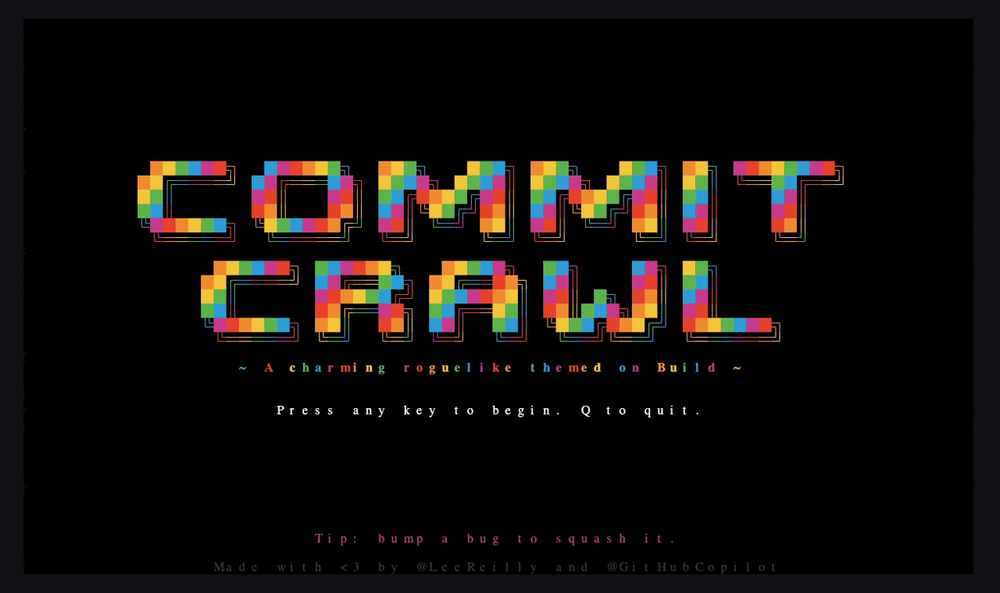
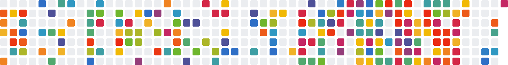
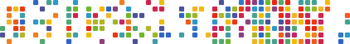

# Commit Crawl

A tiny terminal roguelike themed on Microsoft Build. Squash bugs (`b`), grab green commits (`+`), and climb five letter-shaped dungeons that spell **B-U-I-L-D**.



Survive to the end and `commit-crawl` will render a Build-themed contribution graph for your GitHub handle, but you have to earn it. Throw it on your README profile, your LinkedIn header, or print it and stick it on your (work) fridge.

You'll get a GIF



And an SVG



## Build and play

Requires [Go 1.26+](https://go.dev/dl/). No other dependencies — the SVG and GIF generation is pure Go and works the same on macOS, Linux, and Windows.

```sh
go run ./cmd/commit-crawl
```

Or build a binary:

```sh
go build -o commit-crawl ./cmd/commit-crawl
./commit-crawl
```

Or skip the game and render someone else's Build-themed contribution graph straight to disk (writes both `contribution-graph.svg` and `contribution-graph.gif`):

```sh
go run ./cmd/commit-crawl --user octocat
```


## License

[MIT](LICENSE)

